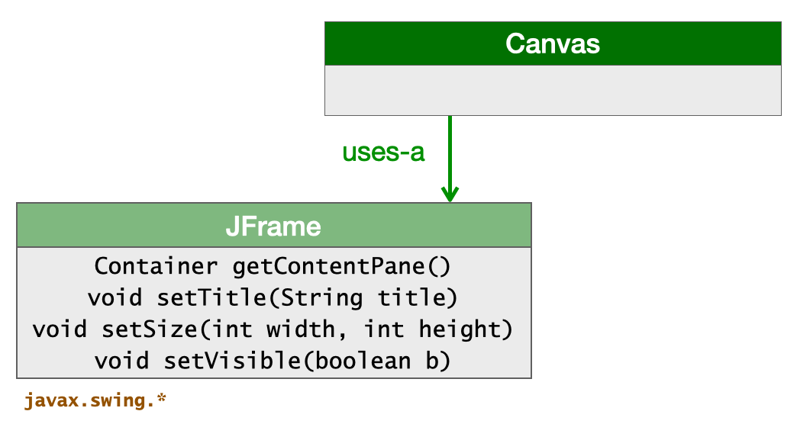
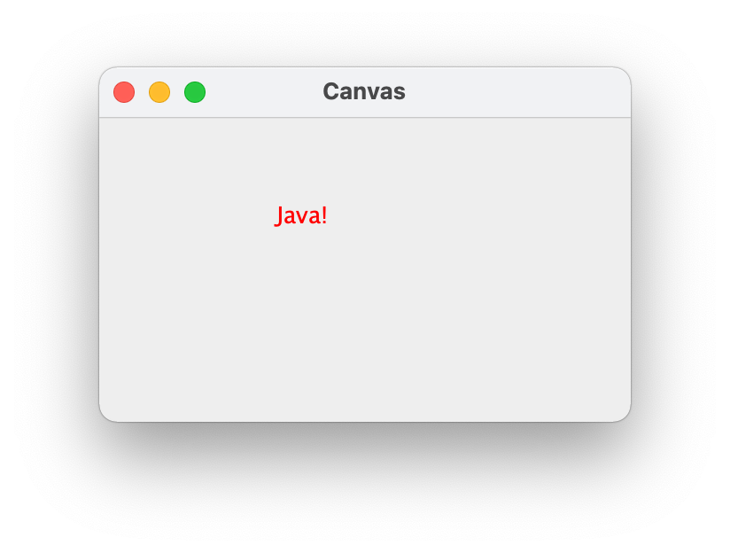
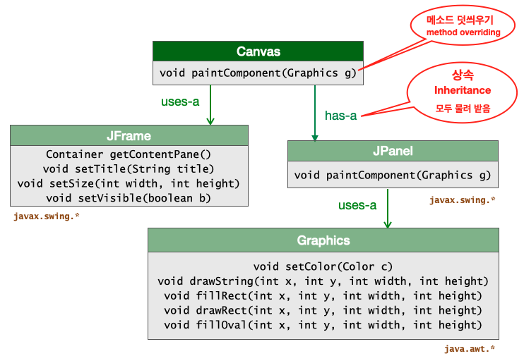
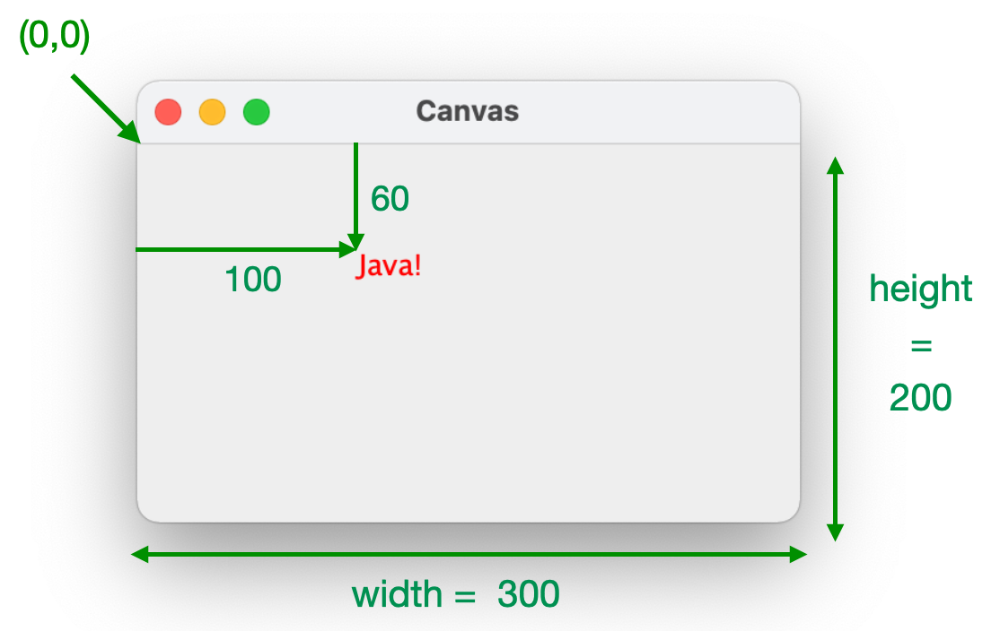
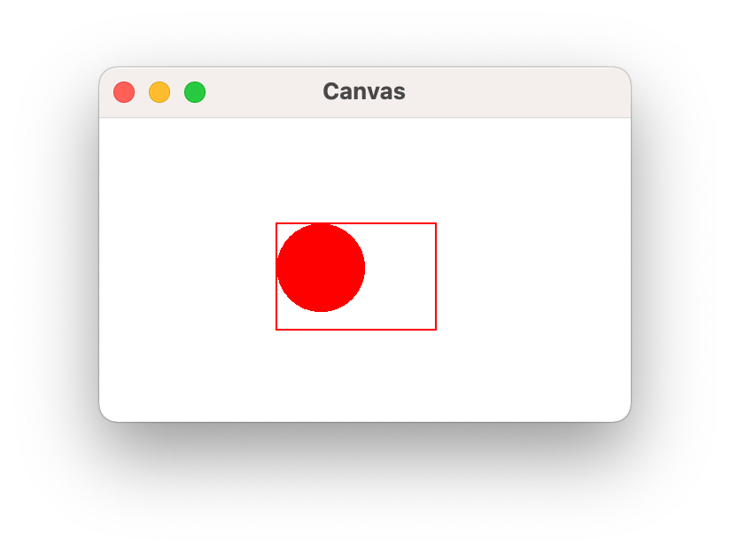
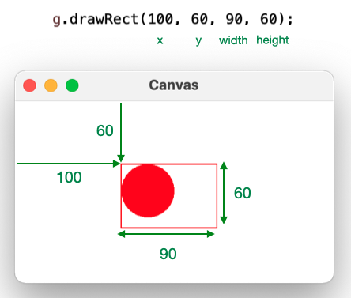
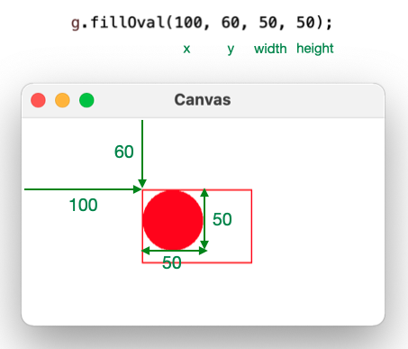
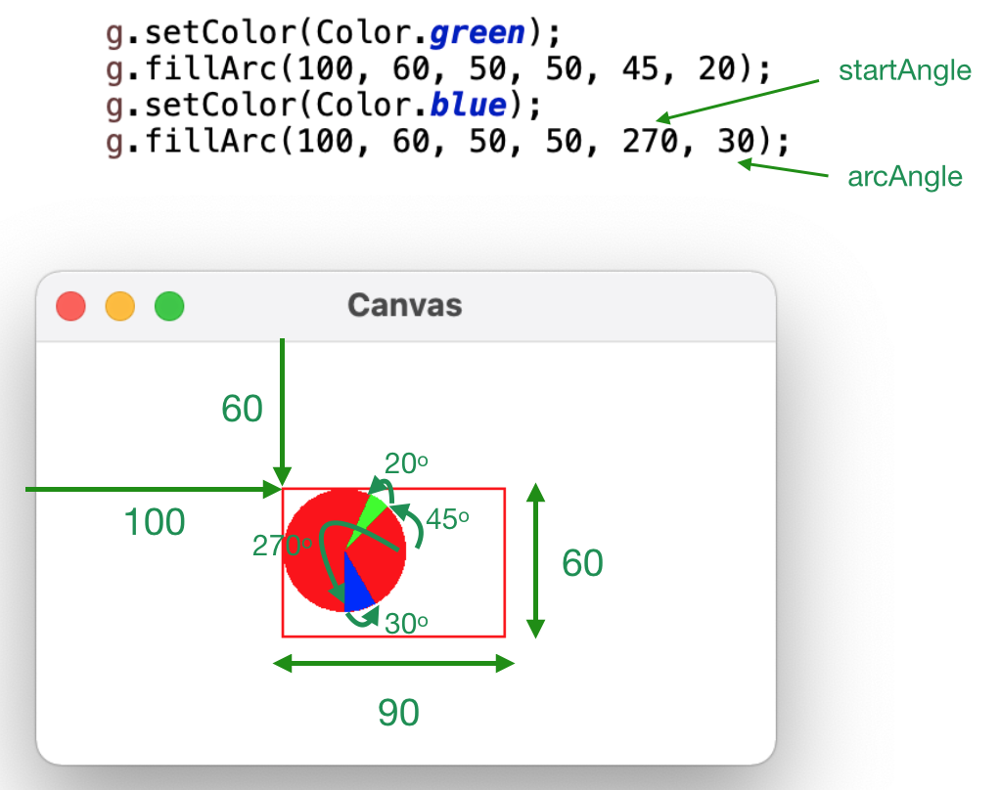
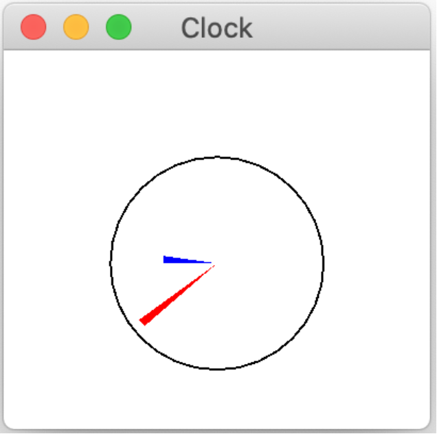

```
(c)도경구 version 0.1 (2021/09/28)
```

## 4. 초기화 메소드와 필드 변수

### 4-1. 초기화 메소드

객체가 태어나면서 저절로 한번 실행하는 메소드를 <b>초기화 메소드</b> 또는 <b>생성 메소드(constructor method)</b>라고 하며, 메소드의 이름은 소속 클래스의 이름과 동일하게 다음과 같은 형식으로 만든다.
```
public class ClassName {

	public ClassName(<type> par_1, ..., <type> par_n) {
		// 몸체 코드 블록
	}
}
```
여기서 괄호 안에 나열한 `<type> par_1`, ..., `<type> par_n` 은 <b>파라미터(parameter)</b> 변수라고 하는데, (일반 메소드 파라미터와 마찬가지로) 변수 선언 형식과 동일하며, 0개 이상 원하는 만큼 나열할 수 있다.
다음과 같이 객체를 생성할 때 이 메소드의 몸체 코드 블록을 딱 한 번 실행한다. 
```
new ClassName(arg_1, ..., arg_n)
```
여기서 괄호 안에 나열한 `arg_1`, ..., `arg_n` 은 <b>인수(argument)</b>라고 하며, 파라미터의 개수와 같아야 한다. 그리고 인수 식을 계산한 결과 값의 타입은 매칭되는 파라미터에서 명시한 타입과 부합해야 한다. 그렇지 않으면 컴파일러가 불평하면서 컴파일을 거부한다. 초기화 메소드를 생략하면 다음과 같이 정의해둔 것과 같다.
```
public class ClassName {

	public ClassName() { }
}
```
따라서 지금까지의 객체 생성은 모두 다음과 같은 형식이었었다.
```
new ClassName()
```

### 4-2. 사례 학습 : 그래픽 아웃풋 윈도우 만들기

그래픽 아웃풋 윈도우(graphical output window)를 띄우는 다양한 그래픽 도형을 그리는 `Canvas` 클래스를 작성하면서, 초기화 메소드를 실전적으로 공부해보자.  

#### 윈도우 프레임 만들기

우선 다음과 같은 모양의 빈 윈도우 프레임을 화면에 띄우는 클래스를 만들어보자.


다음 클래스 다이어그램과 같이 `javax.swing` 패키지가 제공하는 `JFrame` 클래스를 활용하면 된다.



이 다이어그램에서 `uses-a` 라벨이 붙은 화살표는 "활용"하는 관계를 나타낸다. `JFrame` 클래스가 갖고 있는 데이터나 기능을 `Canvas` 클래스가 활용한다는 뜻이다. 객체 생성 초기에 빈 윈도우 프레임을 화면에 띄우는 초기화 메소드 코드를 이 클래스 다이어그램을 참고하여 다음과 같이 작성할 수 있다.

```
import javax.swing.*;

public class Canvas {
	
	public Canvas() {
		JFrame frame = new JFrame();
		frame.setTitle("Canvas");
		frame.setSize(300, 200);
		frame.setVisible(true);
		frame.setDefaultCloseOperation(WindowConstants.EXIT_ON_CLOSE);
	}
	
	// test code
	public static void main(String[] args) {
		new Canvas();
	}

}
```

이 클래스는 아웃풋 뷰 클래스에 속하는 클래스이다. 이러한 클래스를 작성하면서 독립적으로 테스트해보기 위한 방안으로 위와 같이 `main` 메소드를 사용하면 편리하다. `main` 메소드 덕분에 이 클래스는 독립적으로 실행가능하다. 
물론 완성 후에 `main` 메소드는 제거하거나 주석처리 하면 된다.

`main` 메소드에서 `Canvas` 객체를 생성하면서 초기화 메소드를 실행한다. 초기화 메소드를 실행하면, `JFrame` 객체를 생성하고, 그 객체가 제공하는 메소드를 활용하여 윈도우 타이틀과 프레임 크기를 설정하고 윈도우를 띄운다. 여기서 윈도우 프레임의 크기를 나타내는 단위는 픽셀(pixel) 이며, 명시한 `300`과 `200`은 프레임의 가로와 세로 길이 이다.

윈도우 프레임을 만들면 애플리케이션을 실행하는 프로세스와는 별도의 실행 프로세스가 생기면서 독립적으로 작동한다. 윈도우 프레임 상단에 있는 닫기 버튼을 누르면 윈도우가 사라지고 더 이상 다시 띄울 방법은 없는데, 윈도우를 동작시키던 실행 프로세스는 그대로 남아 있다. `JFrame` 객체에 다음 메소드를 활용하면 윈도우가 닫히면서 실행 프로세스도 동시에 종료한다.   
```
frame.setDefaultCloseOperation(WindowConstants.EXIT_ON_CLOSE);
```
나중에 남아 있는 실행 프로세스를 수동으로 하나 하나 제거해야 하는 수고를 하지 않아도 되니 잊지 말고 활용하자. 

####  윈도우에 텍스트 쓰기

윈도우 프레임을 띄웠으니 이제 윈도우 프레임에 다음과 같은 위치에 문자열 텍스트 `Java!`를 디스플레이하는 클래스를 만들어 보자. 



윈도우 프레임에 뭔가를 디스플레이 하려면 그래픽을 그릴 능력을 갖추어야 한다. 그런데 다행히도 `javax.swing` 패키지에 그런 능력을 갖춘 클래스인 `JPanel` 클래스가 준비되어 있다. 이 클래스를 `Canvas` 클래스의 목적에 맞게 활용하기 위해서는 `JPanel` 클래스가 갖고 있는 모든 것을 물려받아 쓰면 된다. 이 관계를 클래스 다이어그램을 그려서 표현하면 다음과 같다.



이 다이어그램에서 `has-a` 라벨이 붙은 화살표는 "상속"하는 관계를 나타낸다. `JPanel` 클래스가 갖고 있는 데이터와 기능을 모두 `Canvas` 클래스가 갖는다. 즉, 모두 상속(물려)받는다는 뜻이다. `JPanel` 클래스는 윈도우를 화면에 띄워서 활성화 할 때마다 저절로 실행되는 `paintComponent` 메소드를 갖고 있는데, 이를 물려받는다. 
물려 받았지만, 화면에 디스플레이할 그래픽 도형을 `paintComponent` 메소드에 새로 구현할 수 있다. 상속받은 메소드와 새로 만든 메소드가 사양이 똑같으므로 충돌이 생기는데, 이 경우를 메소드가 중첩(override, 덧씌우기) 선언되었다고 한다. 메소드가 중첩되면 상속받은 메소드는 무시하고, 새로 만든 메소드가 사용된다. 따라서 `paintComponent` 메소드에 그래픽 도형을 디스플레이하는 코드를 작성해두면, `Canvas` 객체가 만든 윈도우가 활성활 될 때마다 이 메소드가 저절로 실행된다.  

`javax.swing` 패키지의 `JPanel` 클래스를 상속받아 윈도우 프레임에 다음과 같은 위치에 문자열 텍스트 `Java!`를 디스플레이하는 클래스 `Canvas`를 구현하면 다음과 같다. 

```
import javax.swing.*;
import java.awt.*;

public class Canvas extends JPanel {
	
	public Canvas() {
		JFrame frame = new JFrame();
		frame.setTitle("Canvas");
		frame.setSize(300, 200);
		frame.getContentPane().add(this);
		frame.setVisible(true);
		frame.setDefaultCloseOperation(WindowConstants.EXIT_ON_CLOSE);
	}
	
	public void paintComponent(Graphics g) {
		g.setColor(Color.red);
		g.drawString("Java!", 100, 60);
	}
	
	// test code
	public static void main(String[] args) {
		new Canvas();
	}

}
```

먼저 `JPanel` 클래스를 상속받음을 클래스의 헤더에 다음과 같은 형식으로 기술한다. 
```
public class Canvas extends JPanel
```
그리고 윈도우 프레임에 그래픽을 디스플레이하려면 도화지 역할을 하는 `Canvas`(`JPanel`) 객체를 담아서 프레임에 끼울 `Container` 객체가 필요하다. 위 프로그램에서 `frame.getContentPane()`와 같은 형식으로 `JFrame` 객체 `frame`에 요청하면 `Container` 객체를 하나 만들어 내준다. 이 `Container` 객체에 `Canvas`(`JPanel`) 객체를 담는 작업은 연이어 기술한 `.add(this)`가 해준다. `this`를 `Container` 객체에 담아 달라는 요청이다. 여기서 `this`는 미리 정해둔 키워드로 객체 자신을 나타낸다. 생성된 `Canvas` 객체 스스로를(자신을) 가리키는 이름이다. 이 시점이 되면 이제 도화지(`JPanel`)를 `Container`에 담아 프레임에 끼워 넣었으니 그래픽 도형을 그릴 준비가 완료된다.

도화지에 어떤 도형을 그릴지는 `paintComponent` 메소드에 구현한다. 여기 인수로 받는 객체 `Graphics` 객체 `g`는 도형을 그리는 펜 역할을 한다고 생각하면 되고, `java.awt` 팩키지에 준비되어 있으므로 그대로 활용하면 된다. 먼저 다음과 같이 하여 펜의 색깔을 빨간색으로 설정하고,
```
g.setColor(Color.red);
```
이어서 `drawString` 메소드를 호출하여 기술한 위치에 문자열 "Java!"를 디스플레이 한다.
```
g.drawString("Java!", 100, 60);
```
여기서 `100`과 `60`은 위치의 좌표를 나타내는데, 패널에서 원점 `(0, 0)`은 다음 그림에서 표시한대로 패널의 왼쪽 위 꼭지점이다. 즉, 문자열을 새길 위치는 원점에서 x축으로(가로로) 100 픽셀, y축으로(세로로) 60 픽셀 지점으로, 문자열의 좌상단을 가리킨다.




#### 도형 그리기 - 직사각형, 타원

이번에는 윈도우에 다음과 같이 직사각형과 원을 그려보자. 



이 구현하는 프로그램은 다음과 같다.

```
import javax.swing.*;
import java.awt.*;

public class Canvas extends JPanel {
	
	public Canvas() {
		JFrame frame = new JFrame();
		frame.setTitle("Canvas");
		frame.setSize(300, 200);
		frame.getContentPane().add(this);
		frame.setVisible(true);
		frame.setDefaultCloseOperation(WindowConstants.EXIT_ON_CLOSE);
	}
	
	public void paintComponent(Graphics g) {
		g.setColor(Color.white);
		g.fillRect(0, 0, 300, 200);
		g.setColor(Color.red);
		g.drawRect(100, 60, 90, 60);
		g.fillOval(100, 60, 50, 50);
	}
	
	// test code
	public static void main(String[] args) {
		new Canvas();
	}

}
```

`paintComponent` 메소드를 읽어보면 다음과 같다. 먼저 `setColor` 메소드를 호출하여 펜의 색깔을 하얀색으로 골르고, `fillRect` 메소드를 호출하여 패널 전체를 하얀색으로 채우고, `setColor` 메소드를 다시 호출하여 펜의 색깔을 빨간색으로 바꾸고, `drawRect` 메소드를 호출하여 직사각형을 그리고, `fillOval` 메소드를 호출하여 원을 그린다. 

각 메소드의 인수가 어떤 의미를 가지는지 하나씩 알아보자. 도형을 그리는 `fillRect`, `drawRect`, `fillOval` 메소드의 첫 두 인수는 도형의 위치 x와 y 좌표, 다음 두 인수는 도형의 크기를 나타낸다. 메소드 이름 앞 부분의 `fill`은 도형을 펜 색깔로 채우라는 뜻이고, `draw`는 도형의 테두리를 펜 색깔로 그리라는 뜻으로 이해하면 된다. 메소드 이름 뒷 부분의 `Rect`는 직사각형, `Oval`은 타원을 의미한다. 도형을 그릴 위치는 원칙적으로 도형의 왼쪽 위 꼭지점을 가리키는데 도형의 모양에 따라 방식이 있다 각각 알아보면 다음 그림과 같다. 



사각형의 경우, 첫 두 인수는 사각형의 좌상단 꼭지점의 x 좌표, y 좌표이다. 그리고 다음 두 인수는 각각 사각형의 가로, 세로의 길이이다.



타원의 경우 첫 두 인수는 타원을 최대한 맞게 둘러싼 사각형의 좌상단 꼭지점의 x 좌표, y 좌표이다. 그리고 다음 두 인수는 각각 타원의의 가로 지름, 세로 지름의 길이이다. 자연히 가로 지름과 세로 지름이 같으면 원이 된다. 


####  아크 그리기

타원의 일부 아크(arc)를 그릴 수 있다. 예를 들어 다음 그림과 같이 녹색, 파란색 아크는 더하고 싶으면, `paintComponent` 메소드에 아래와 같이 네 줄을 추가하면 된다.



첫 네 인수는 타원을 그리는 요령과 같이 위치와 크기를 지정하고, 다섯째와 여섯째 인수는 아크의 위치와 크기를 결정한다. 타원의 중심을 기준으로 시계로 따져서 3시가 0도이고, 12시가 90도, 9시가 180도, 6시가 270도이다. 따라서 다섯째 인수는 아크가 시작하는 각도를 나타내고, 여섯째 인수는 아크의 너비를 나타내는 각도이다. 


#### 아날로그 시계 그리기 (시침 + 분침)

지금까지 공부한 내용을 바탕으로 현재 시각을 표시하는 아날로그 시계를 다음과 같이 보여주는 윈도우를 만들어보자.



사양은 다음 그림과 같다.


구현한 프로그램은 다음과 같다.

```
import java.awt.*;
import javax.swing.*;
import java.time.*;

public class ClockWriter extends JPanel {
	
	public ClockWriter() {
		int width = 200;
		// 프레임 생성 
		JFrame frame = new JFrame();
		// 자신(패널)을 프레임에 끼우기 
		frame.getContentPane().add(this);
		// 프레임 만들어 보여주기 
		frame.setTitle("Clock");
		frame.setSize(width,width);
		frame.setVisible(true);
		frame.setDefaultCloseOperation(WindowConstants.EXIT_ON_CLOSE);
	}
	
	public void paintComponent(Graphics g) {
		int width = 200;
		// 바탕은 흰색으로 
		g.setColor(Color.white);
		g.fillRect(0, 0, width, width);
		// 현재 시간 + 시침, 분침 각도 계산
		LocalTime now = LocalTime.now();
		int minutes_angle = 90 - now.getMinute() * 6;
		int hours_angle = 90 - now.getHour() * 30;
		// 시계 크기 설정
		int x = 50;
		int y = 50;
		int diameter = 100;
		// 시계 판 그리기
		g.setColor(Color.black);
		g.drawOval(x, y, diameter,diameter);
		// 분침 그리기
		g.setColor(Color.red);
		g.fillArc(x+5, x+5, diameter-10, diameter-10, minutes_angle, 5);
		// 시침 그리기 
		g.setColor(Color.blue);
		g.fillArc(x+25, x+25, diameter-50, diameter-50, hours_angle, -8);
	}

	public static void main(String[] args) {
		new ClockWriter();
	}
}
```

#### 필드 변수 추가

위 프로그램에서 시계의 크기는 고정되어 있다. 시계의 크기를 조정하고 싶으면, 바늘의 길이, 너비 등 관련 값들을 모두 다시 고쳐야 한다. 크기의 기준 값을 변수로 정해놓고 시계판의 크기와 바늘의 길이, 너비를 변수에 맞게 계산하도록 하면, 시계 크기를 필요에 따라 유연하게 조정할 수 있다. 이러한 기준 값 역할을 하는 변수는 객체가 영구히 기억하고 있어서 필요할 때마다 수정 또는 참조할 수 있어야 한다. 이런 역할을 하는 변수를 따로 두고 지정해야 하는데 이를 필드(field) 변수라고 하면 메소드의 외부에 다음 코드와 같이 선언하여 사용한다. 필드 변수는 객체의 상태를 기억하고 있는 변수라고 하여, 상태 변수라고도 한다. 상태 변수를 두면, 이 클래스를 사용하는 측에서 필요에 따라 얼마든지 크기를 지정할 수 있다. 이 값은 보통 다음 코드와 같이 초기화 메소드의 인수로 전달하여 설정한다. 


```
import java.awt.*;
import javax.swing.*;
import java.time.*;

public class ClockWriter extends JPanel {
	
	private int width;
	
	public ClockWriter(int w) {
		// 프레임 크기 기준값 설정
		width = w;
		// 프레임 생성 
		JFrame frame = new JFrame();
		// 자신(패널)을 프레임에 끼우기 
		frame.getContentPane().add(this);
		// 프레임 만들어 보여주기 
		frame.setTitle("Clock");
		frame.setSize(width,width);
		frame.setVisible(true);
		frame.setDefaultCloseOperation(WindowConstants.EXIT_ON_CLOSE);
	}
	
	public void paintComponent(Graphics g) {
		
		// 바탕은 흰색으로 
		g.setColor(Color.white);
		g.fillRect(0, 0, width, width);
		// 현재 시간 + 시침, 분침 각도 계산
		LocalTime now = LocalTime.now();
		int minutes_angle = 90 - now.getMinute() * 6;
		int hours_angle = 90 - now.getHour() * 30;
		// 시계 크기 설정
		int x = width / 4;
		int y = width / 4;
		int diameter = width / 2;
		// 시계 판 그리기
		g.setColor(Color.black);
		g.drawOval(x, y, diameter,diameter);
		// 분침 그리기
		g.setColor(Color.red);
		g.fillArc(x+5, x+5, diameter-10, diameter-10, minutes_angle, 5);
		// 시침 그리기 
		g.setColor(Color.blue);
		g.fillArc(x+25, x+25, diameter-50, diameter-50, hours_angle, -8);
	}

	public static void main(String[] args) {
		new ClockWriter(500);
	}
}
```

#### `final` 변수

- 값을 한 번밖에 지정할 수 없음
- 값이 변하지 않으므로 상수(constant)라고 함
- 모두 대문자로 씀

```
import java.awt.*;
import javax.swing.*;
import java.time.*;

public class ClockWriter extends JPanel {
	
	private final int WIDTH;
	
	public ClockWriter(int w) {
		// 프레임 크기 기준값 설정
		WIDTH = w;
		// 프레임 생성 
		JFrame frame = new JFrame();
		// 자신(패널)을 프레임에 끼우기 
		frame.getContentPane().add(this);
		// 프레임 만들어 보여주기 
		frame.setTitle("Clock");
		frame.setSize(WIDTH, WIDTH);
		frame.setVisible(true);
		frame.setDefaultCloseOperation(WindowConstants.EXIT_ON_CLOSE);
	}
	
	public void paintComponent(Graphics g) {
		
		// 바탕은 흰색으로 
		g.setColor(Color.white);
		g.fillRect(0, 0, WIDTH, WIDTH);
		// 현재 시간 + 시침, 분침 각도 계산
		LocalTime now = LocalTime.now();
		int minutes_angle = 90 - now.getMinute() * 6;
		int hours_angle = 90 - now.getHour() * 30;
		// 시계 크기 설정
		int x = WIDTH / 4;
		int y = WIDTH / 4;
		int diameter = WIDTH / 2;
		// 시계 판 그리기
		g.setColor(Color.black);
		g.drawOval(x, y, diameter,diameter);
		// 분침 그리기
		g.setColor(Color.red);
		g.fillArc(x+5, x+5, diameter-10, diameter-10, minutes_angle, 5);
		// 시침 그리기 
		g.setColor(Color.blue);
		g.fillArc(x+25, x+25, diameter-50, diameter-50, hours_angle, -8);
	}

	public static void main(String[] args) {
		new ClockWriter(400);
	}
}
```

