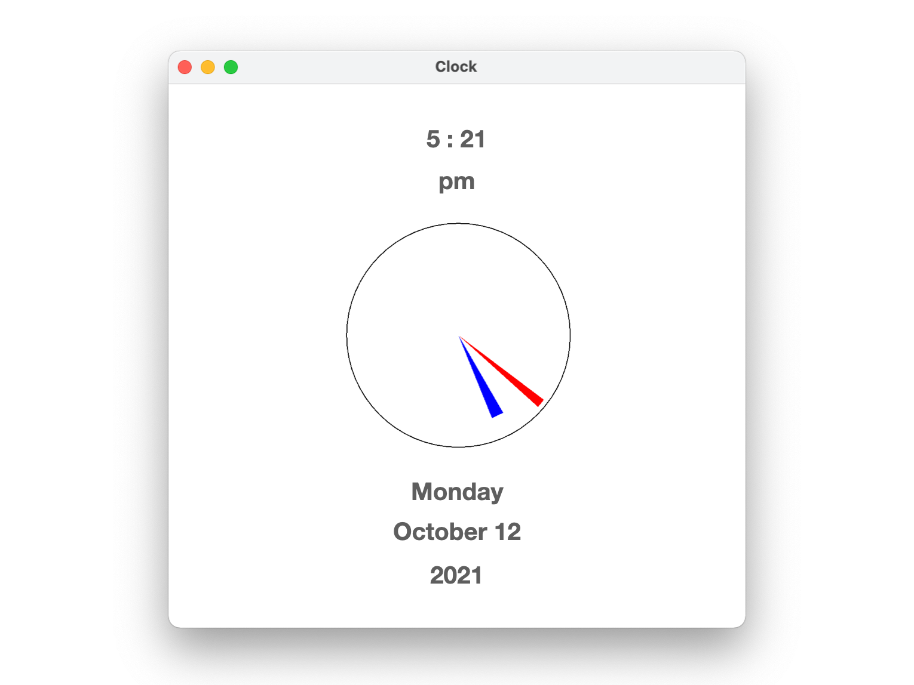

```
(c)도경구 version 0.1 (2021/10/11)
```

## 5. 반복 제어 구조


## 숙제 -  데스크 탑 용 시계 완성 (제출 마감: 10월 19일 오후 12:59)

4주차에 숙제로 완성했던 아날로그 시계를 이번에는 스스로 작동하도록 개선하자.
아날로그 시계의 초침은 1초마다 움직이고, 분침은 1분마다 움직이고, 시침은 12분마다 움직여야 한다.
그리고 현재 년, 월, 일, 요일, 시간, 오전/오후 여부를 윈도우의 적절한 위치에 아래 그림과 같이 배치하여 표시한다.
이 정보도 항상 저절로 바뀌도록 해야 한다. 배치하는 위치나 디자인은 아래 그림과 같을 필요가 없이 각자 자유에 맡긴다.



