```
(c)도경구 version 0.1 (2021/10/31)
```

## 8. 인터페이스를 활용한 프로그램 부품화


## 숙제 -  스도쿠 퍼즐 게임 (제출 마감: 10월 26일 13:00)

스도쿠(Sudoku) 퍼즐은 보드게임으로 가로 9칸 세로 9칸의 9×9 격자 보드에 1부터 9까지의 숫자를 정해놓은 규칙에 맞게 채워 넣는 퍼즐 게임이다. 스도쿠 퍼즐 게임 애플리케이션을 만들어보자.

시작 시점의 스도쿠 보드는 다음 그림과 같은 모양이며, 칸의 일부는 1에서 9까지의 숫자로 채워져 있지만, 일부는 비어 있다. 

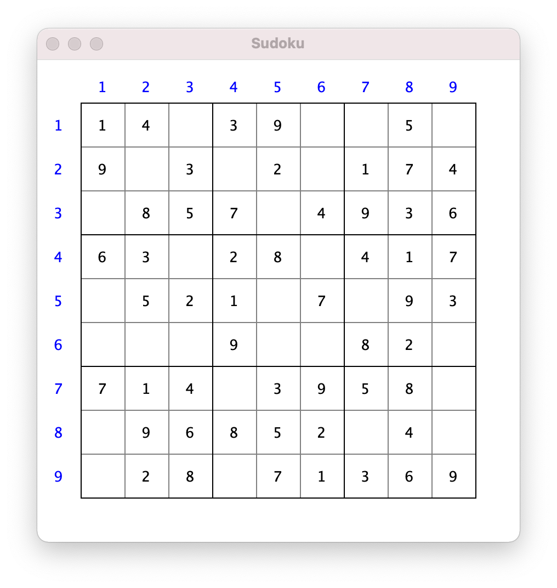

빈칸을 다음 그림과 같이 모두 채우면 퍼즐 게임이 끝난다.

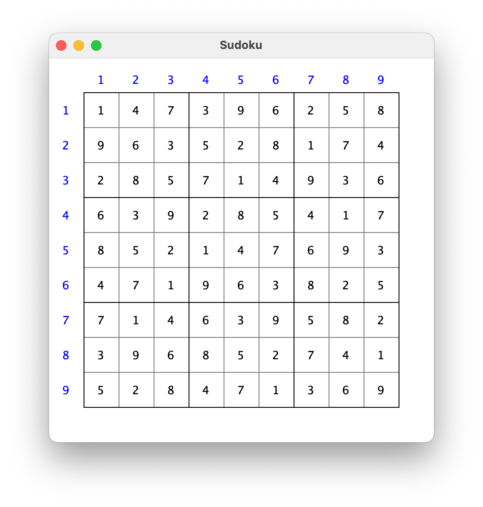

빈칸에 숫자를 채우는 규칙은 다음과 같다. 

- 9개의 세로줄과 9개의 가로줄에 1에서 9까지의 숫자를 하나씩만 넣어서 겹치지 않아야 하고,
- 3×3의 단위로 9등분한 격자 보드에도 1에서 9까지의 숫자를 하나씩만 넣어서 겹치지 않아야 한다.

위 그림에 채워진 숫자를 확인하여 이 규칙을 준수했는지 확인해보자.

### 난이도 옵션

스도쿠 퍼즐게임은 빈칸이 많을수록 퍼즐 풀기가 어려워진다. 따라서 게임을 시작하면서 플레이어가 난이도를 스스로 선택하도록 한다. 다음 그림과 같이 창을 띄워 난이도에 따라 1,2,3 중에서 선택하도록 한다.


다음 그림은 플레이어가 1을 선택한 그림이다.

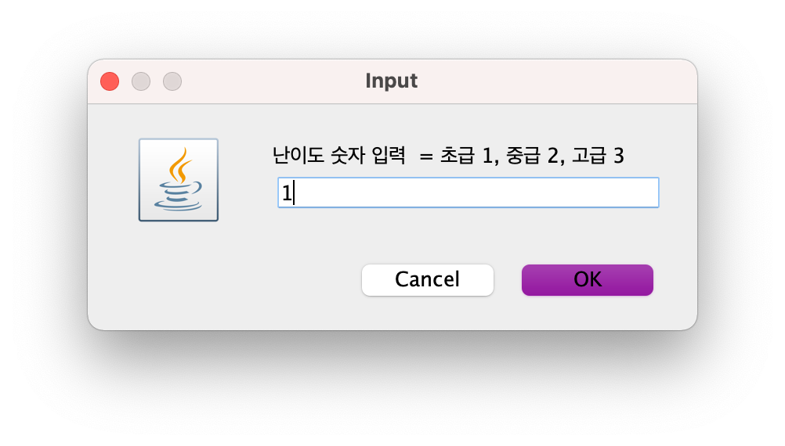

난이도에 따른 빈칸의 개수는 다음과 같이 정한다.
- 초급 = 27
- 중급 = 36
- 고급 = 45

### 퍼즐 게임의 진행

스도쿠 보드를 보면 왼쪽과 위쪽에 줄 번호가 있다. 


왼쪽은 가로줄 번호를 나타내고, 위쪽은 세로줄 번호를 나타낸다. 먼저 다음과 같은 창을 띄워 가로줄 번호를 받는다.

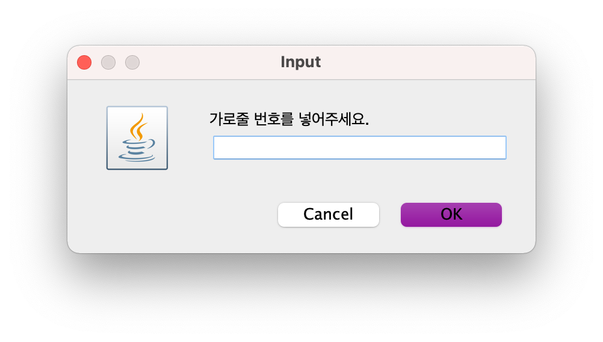

플레이어는 5를 넣고 OK 버튼을 누른다.

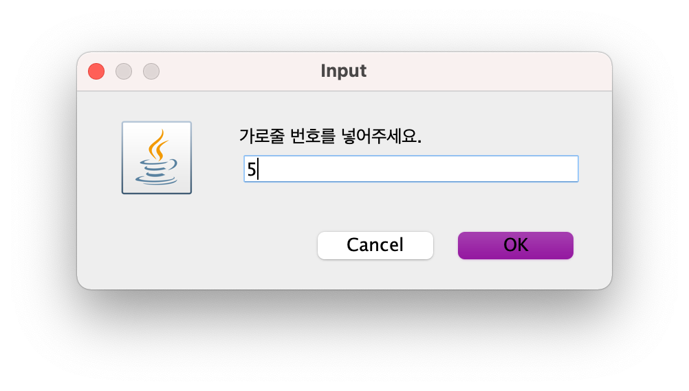

그리고 나서 다음과 같은 창을 띄워 세로줄 번호를 받는다.

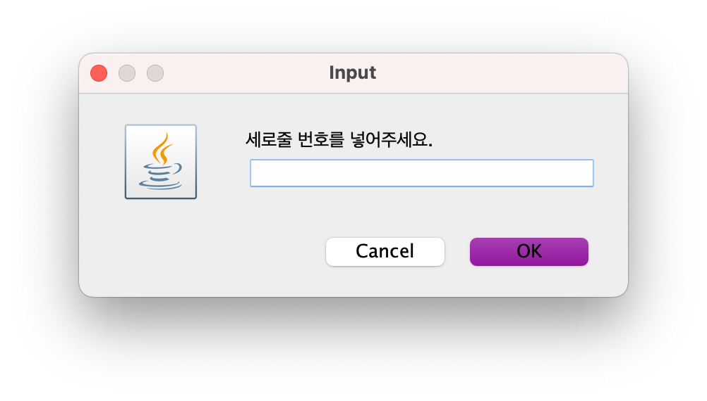

플레이어는 7을 넣고 OK 버튼을 누른다.

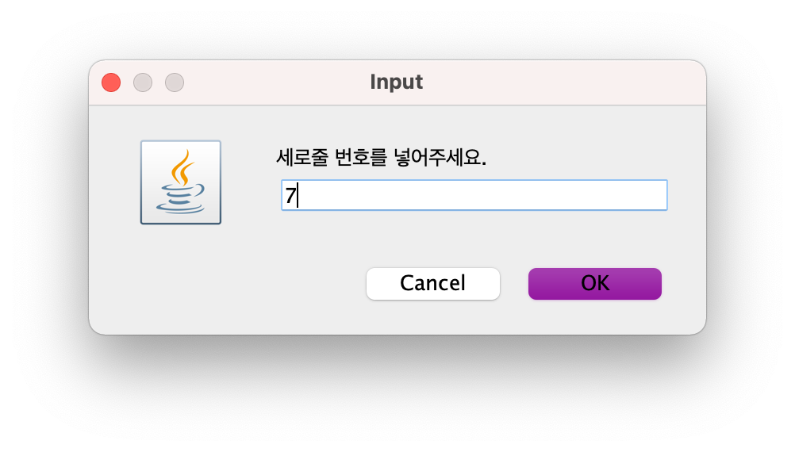

그리고 나서 다음과 같은 창을 띄워 해당 빈칸에 채울 숫자를 받는다.


플레이어는 6을 넣고 OK 버튼을 누른다.

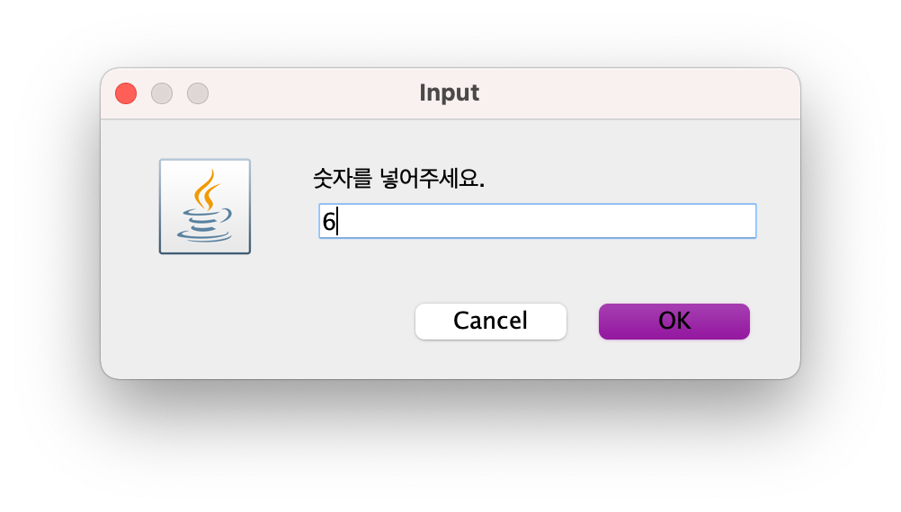

가로줄 5와 세로줄 7에 해당하는 칸이 빈칸이 맞고, 넣은 숫자 6이 스도쿠 규칙을 만족하므로 다음과 같이 빈칸에 해당 숫자가 채워진다.

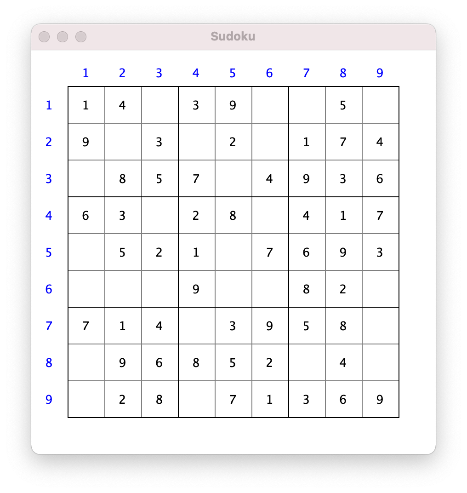

지정한 칸이 빈칸이 아니거나 넣으려는 숫자가 스도쿠 규칙을 만족하지 않으면, 플레이어의 시도는 무시하고 게임을 계속 진행하도록 한다.

빈칸을 모두 채우면 게임이 끝난다. 

### 설계도

다음 클래스 다이어그램과 같이 이 애플리케이션을 설계했다.

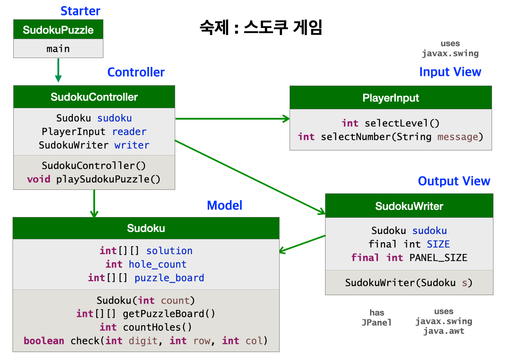

주요 클래스의 명세서도 다음과 같이 작성하였다.


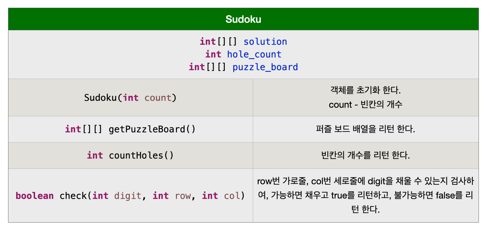

Starter와 View 클래스는 모두 구현을 완성하였고, 모델 클래스 `Sudoku`와 컨트롤러 클래스 `SudokuController` 클래스만 아직 미완성이다. 미완성인 아래 두 클래스의 빈 부분을 채워 구현을 완성하자.

```
import java.util.*;

public class Sudoku {
	
	private int[][] solution = new int[9][9];
	private int hole_count;
	private int[][] puzzle_board = new int[9][9];
	
	/** 객체 초기화 메소드 
	 * 
	 * @param count - 빈칸의 개수 
	 */
	public Sudoku(int count) {
		createSolutionBoard();
		hole_count = count;
		createPuzzleBoard(count);
	}
	
	/** 퍼즐 보드 배열을 리턴 한다. 
	 * 
	 * @return 퍼즐 보드 배열
	 */
	public int[][] getPuzzleBoard() {
		return puzzle_board;
	}
	
	/** 빈칸의 개수를 리턴 한다.
	 * 
	 * @return 빈칸의 개수
	 */
	public int countHoles() {
		return hole_count;
	}
	
	// [배점 = 0.5/2.0]
	/** 해답 스도쿠 보드인 solution 배열을 무작위로 섞어서 만든다. */
	private void createSolutionBoard() {
		// 1~9 범위의 무작위 시퀀스 {n1,n2,n3,n4,n5,n6,n7,n8,n9}를 만들고,
		// 이를 문서에 첨부한 그림 1과 같이 solution 배열에 배치 한다.


        // 문서에 첨부한 그림 2와 같이 가로줄 바꾸기와 세로줄 바꾸기를 무작위로 한다.
        // 무작위로 줄 바꾸기를 한다는 말은 바꿀지 말지를 무작위로 결정한다는 의미이다.
        // 가로줄 바꾸기
		shuffleRibbons();
		// 세로줄 바꾸기
		transpose();
		shuffleRibbons();
		transpose();
		// 테스트용 메소드
		showBoard(solution);
	}
	
	/** 0~n-1 범위의 정수 수열을 무작위로 섞은 배열을 리턴 한다.
	 * 
	 * @param n - 수열의 길이 
	 * @return 0~n-1 범위의 정수를 무작위로 섞어 만든 배열 
	 */
	private int[] generateRandomPermutation(int n) {
		Random random = new Random();
	    int[] permutation = new int[n];
	    for (int i = 0; i < n; i++) {
	        int d = random.nextInt(i+1);
	        permutation[i] = permutation[d];
	        permutation[d] = i;
	    }
	    return permutation;
	}
	
	/** 문서에 첨부한 그림 2와 같은 전략으로 solution 배열의 가로줄을 무작위로 섞는다. */
	private void shuffleRibbons() {
		int[][] shuffled = new int[9][9];
		int[] random_index; 
		for (int i = 0; i < 3; i++) {
			random_index = generateRandomPermutation(3);
			for (int j = 0; j < 3; j++)
				shuffled[i*3+random_index[j]] = solution[i*3+j]; 
		}
		solution = shuffled;
	}
	
	/** solution 배열의 행과 열을 바꾼다. */
	private void transpose() {
		int[][] transposed = new int[9][9];
		for (int i = 0; i < 9; i++)
			for (int j = 0; j < 9; j++)
				transposed[i][j] = solution[j][i];
		solution = transposed; 
	}
	
	/** 2차원 배열 b를 콘솔 윈도우에 보여준다. (테스트용 메소드)
	 * 
	 * @param b - 2차원 배열 
	 */
	private void showBoard(int[][] b) {
		System.out.println("스도쿠 보드");
		for (int i = 0; i < 9; i++) {
			for (int j = 0; j < 9; j++)
				System.out.print(b[i][j] + " ");
			System.out.println();
		}
	}
	
	// [배점 = 0.5/2.0]
	/** solution 배열에서 count 만큼 무작위로 빈칸을 채워 puzzle_board 배열을 만들어 리턴한다.
	 *  
	 * @param count - 빈칸의 개수 
	 */
	private void createPuzzleBoard(int count) {
		// solution 보드를 그대로 puzzle_board에 복제한다.
		
			
				
		// 무작위로 빈칸을 선정한다. 빈칸은 구별을 위해서 0으로 채운다.
		// new Random().nextInt(n) 메소드를 호출하면 
		// 0~n-1 범위의 정수 중에서 무작위로 하나를 고를 수 있다.
		
		
		
			
			
			
				
				
			
		
	}
	
	// [배점 0.5/2.0]
	/** row번 가로줄, col번 세로줄에 digit을 채울 수 있는지 검사하여, 
	 *  가능하면 채우고 true를 리턴하고, 불가능하면 false를 리턴 한다.
	 * 
	 * @param digit - 빈칸에 채울 수 (1~9 중 하나) 
	 * @param row - 가로줄 번호 
	 * @param col - 세로줄 번호 
	 * @return 퍼즐 보드 조건에 만족하여 빈칸을 채웠으면 true, 만족하지 않으면 false 
	 */
	public boolean check(int digit, int row, int col) {
		
			
			
			
		
		
		
	}
}
```

```
public class SudokuController {
	
	private Sudoku sudoku;
	private PlayerInput reader;
	private SudokuWriter writer;
	
	/** Sudoku, PlayerInput, SudokuWriter 객체를 생성하여 필드 변수에 지정한다. */
	public SudokuController() {
		reader = new PlayerInput();
		int hole_count = reader.selectLevel();
		sudoku = new Sudoku(hole_count);
		writer = new SudokuWriter(sudoku);
	}
	
	// [배점 0.5/2.0]
	/** 스도쿠 퍼즐 게임을 진행한다. */
	public void playSudokuPuzzle() {
		
		
			
			
			
			
				
	}
}

```

### 미완성 코드

([코드 다운로드](code07/sudoku.zip))

### 첨부

#### 그림 1

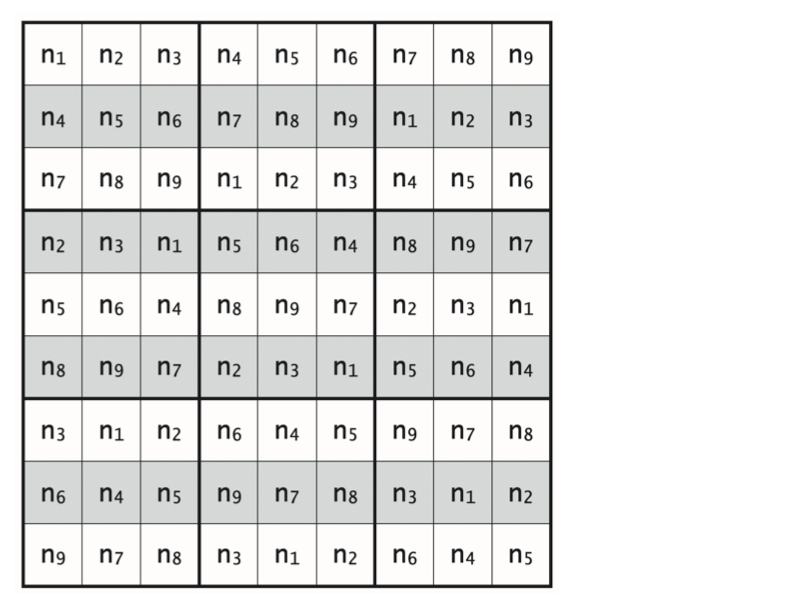

#### 그림 2

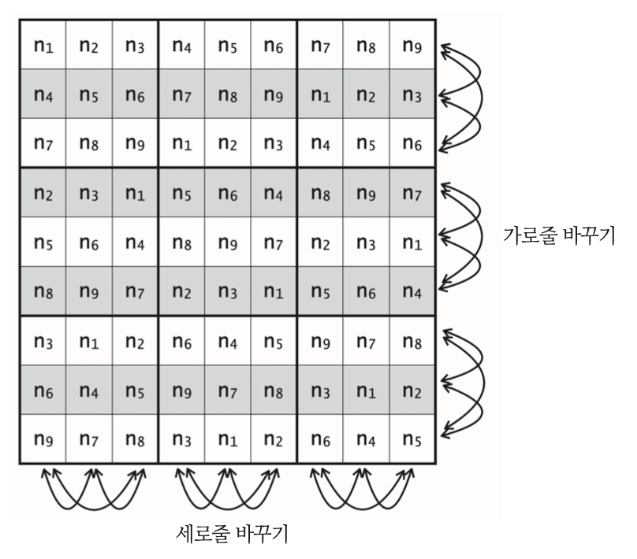