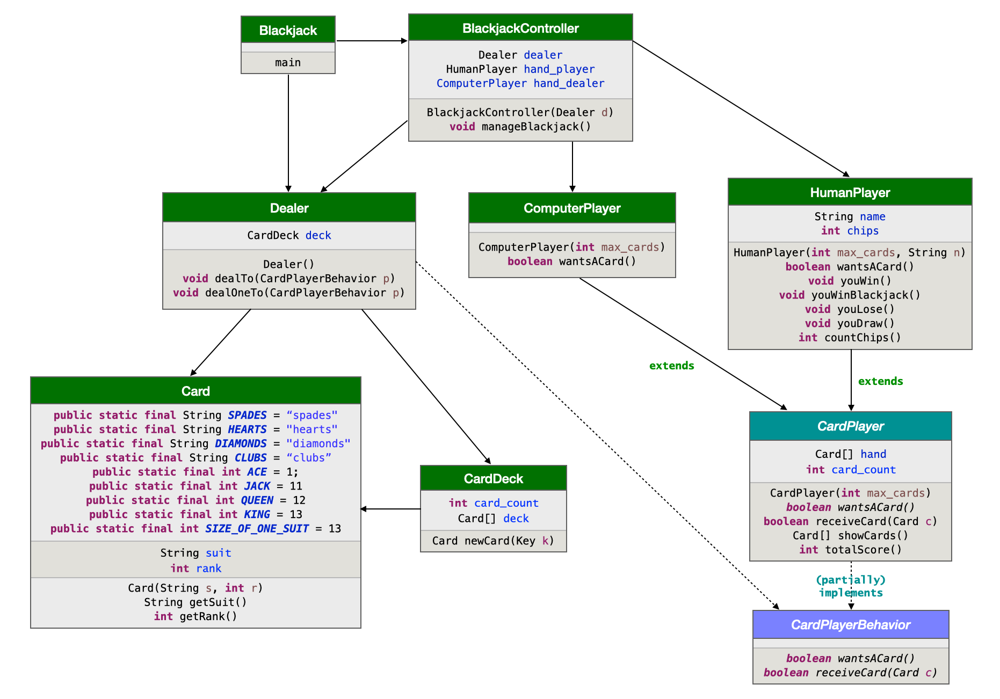
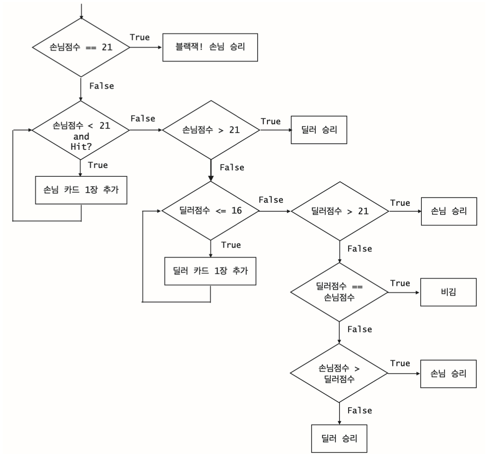

```
(c)도경구 version 0.1 (2021/11/03)
```

## 8.  상속을 활용한 프로그램 부품의 재사용


### 숙제 -  블랙잭 카드 게임 (제출 마감: 11월 9일 13:00)

블랙잭(Sudoku)은 카지노에서 가장 인기 있는 카드게임 중 하나이다. 갖고 있는 카드 점수의 합이 21을 넘지 않는 한도 내에서, 딜러와 겨루어 점수가 높으면 이기는 게임이다.

블랙잭에 사용하는 놀이 카드는 스페이드(spade), 하트(heart), 클럽(club), 다이아몬드(diamond)의 네 가지 무늬(suit)가 있으며, 무늬별로 A, 2, 3, 4, 5, 6, 7, 8, 9, 10, J, Q, K의 13 가지 끗수(rank)가 있어서, 총 52장으로 구성된다.

#### 블랙잭의 카드 점수 매기는 규칙

- A(Ace) 카드는 1점 또는 11점 중 유리한대로 선택할 수있다. 
- J, Q, K 카드의 점수는 각각 10점이다.
- 나머지 카드 2\~10의 점수는 액면대로 매긴다.

#### 블랙잭 게임 규칙

1. 딜러가 카드 두 장을 손님과 자신에게 각각 한 장씩 교대로 나누어 준다. 
2. 딜러의 첫째 카드는 공개하지 않고, 나머지 카드는 모두 공개한다.
3. 처음 받은 카드 두 장이 A와 10, J, Q, K 중 하나로 구성되어 합이 21이 되면 블랙잭으로 손님이 무조건 이긴다.
4. 손님은 먼저 받은 카드 두 장의 합이 21에 못 미치면, 원하는 만큼 한 장씩 더 받을 수 있다.
5. 21을 초과하면 버스트(bust)가 되어 무조건 진다.
6. 딜러는 카드의 합이 16 이하이면 카드를 무조건 더 받아야 하고, 17 이상이면 더
이상 받을 수 없다.
7. 딜러 카드의 합과 손님 카드의 합이 같으면 비긴다.

블랙잭 카드게임 애플리케이션을 아래의 클래스 다이어그램에서 제시한 대로 구현하자.



이 다이어그램에 뷰 클래스는 생략되어 있다. 
일단 다음의 요구 사항대로 구현한다.


#### 요구 사항


1. 손님의 이름을 입력 받는다. (`swing` 패키지의 `JOptionPane.showInputDialog()` 활용)

2. 카드는 1벌(52장)을 잘 섞어서 사용한다. 다 쓰면 1벌을 새로 만들어 다시 잘 섞 어서 사용한다. (수업 시간에 작성한 `Card`와 `CardDeck` 클래스 활용)

3. 카드는 처음 2장씩 나누어 주는데, 손님, 딜러, 손님, 딜러 순으로 나누어주고, 딜 러의 첫 카드는 감춘다.

4. 손님은 점수가 21점 미만인 경우 카드를 추가로 요청할 수 있다.

5. 손님에게 추가 카드를 원하는지 물어봐야 하며, 손님은 y(예) 또는
n(아니오)로 의사를 표시한다. (`swing` 패키지의 `JOptionPane.showInputDialog()` 활용)

6. 딜러는 카드의 합이 16점 이하이면 카드를 추가로 한 장 무조건 받아야 하며, 16점을 넘으면 더 이상 받을 수 없다.

7. A(에이스)는 1점 또는 11점 중 하나를 유리한 쪽으로 선택할 수 있어야 한다.

8. 손님은 이길 때마다 칩을 하나씩 획득한다. 첫 두장의 합이 21이 되면 딜러의 카드는 볼 필요 없이 손님이 이기는데, 이 경우 칩을 두개 획득한다. 손님이 지면 칩을 하나 잃는다. 손님이 보유하고 있는 칩의 개수는 매 라운드가 진행하면서 항상 보여주어야 한다. 잃은 경우 음수가 될 수도 있다.

9. 매 라운드마다 게임을 계속할지 물어봐야 하며, 손님은 y(예) 또는 n(아니오)로 의사를 표시한다. (`swing` 패키지의 `JOptionPane.showInputDialog()` 활용)

10. 게임을 진행하면서 받은 딜러와 손님의 카드는 모두 텍스트로 보여주어야 하며, 손님이 보유하고 있는 칩의 개수도 텍스트로 보여주어야 한다. (`swing` 패키지의 `JFrame`를 활용하여 게임 진행 상황을 패널에 텍스트로 그린다.)


#### 승패 판정 흐름도



