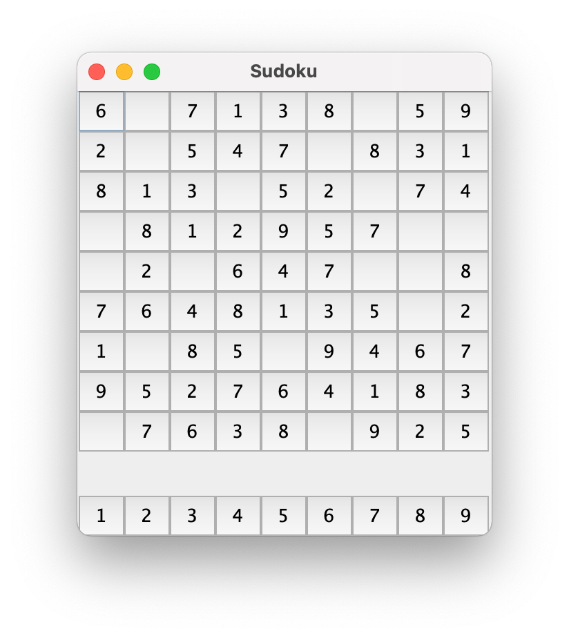
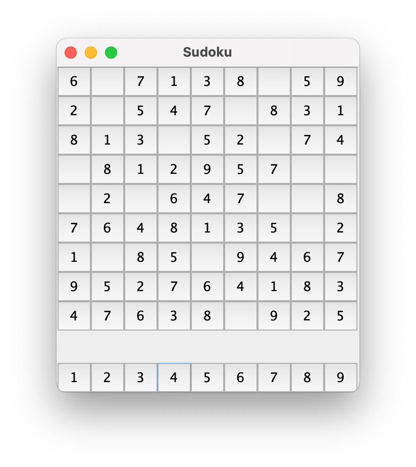

```
(c)도경구 version 0.1 (2021/11/10)
```

## 9. GUI와 이벤트 구동 프로그래밍


### 숙제 -  스도쿠 퍼즐 게임 (제출 마감: 11월 16일 13:00)

지난 숙제로 작성한 스도쿠 퍼즐 게임 애플리케이션을 버튼을 활용하여 게임을 진행할 수 있도록 개선해보자.

버튼 기능 구현에 집중하기 위해서 난이도 옵션은 고려하지 않고 보드의 빈칸 18개로 게임을 시작할 수 있도록 고정하기로 한다.

애플리케이션을 실행하면 다음과 같은 보드가 나타난다.



스도쿠 보드 버튼은 위 부분에 위치하고, 선택할 숫자 버튼은 아래 부분에 위치한다.
퍼즐 게임은 다음과 같은 순서로 진행한다.
1. 보드의 빈 칸을 클릭한다.
2. 아어서 그 빈칸을 채울 숫자를 아래 숫자 버튼 중에서 골라서 클릭한다.
3. 2번에서 클릭한 숫자가 정답이면 그 숫자로 1번에서 클릭했던 빈칸을 채운다.
4. 2번에서 클릭한 숫자가 오답이면 아무것도 바뀌지 않는다.

이 과정은 빈칸을 모두 채울때 까지 진행할 수 있다.

위 보드의 아래 왼쪽 구석의 빈칸을 클릭하고, 숫자 4를 클릭한 후 스도쿠 보드는 다음과 같이 바뀐다.




