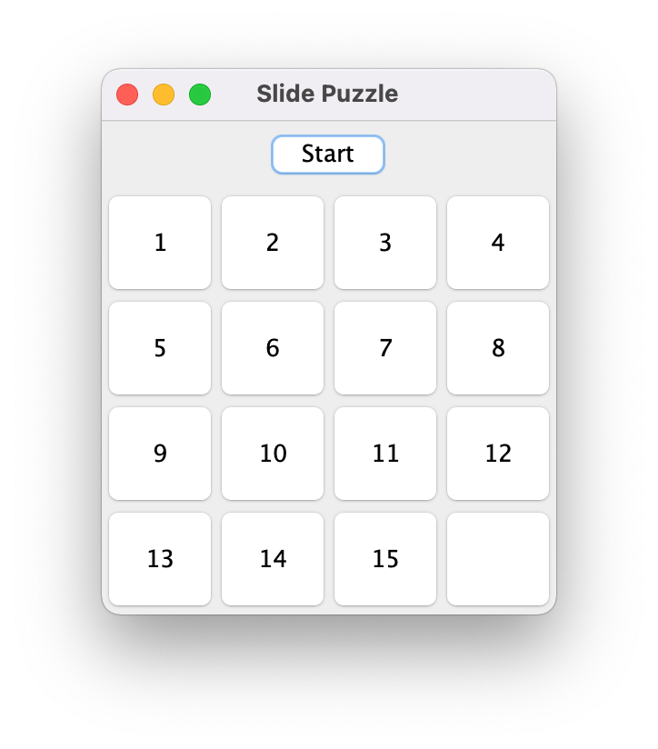
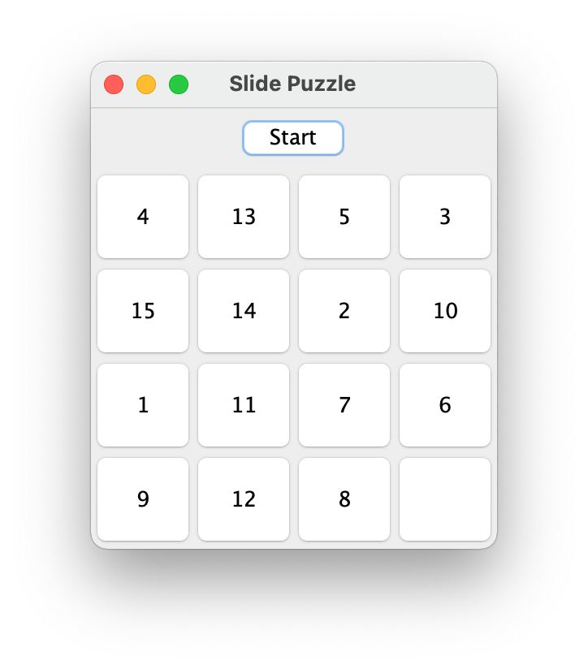
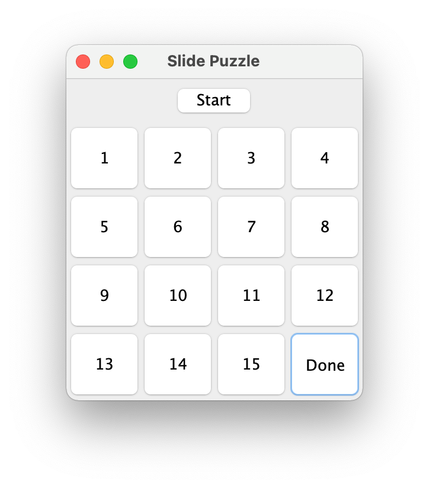
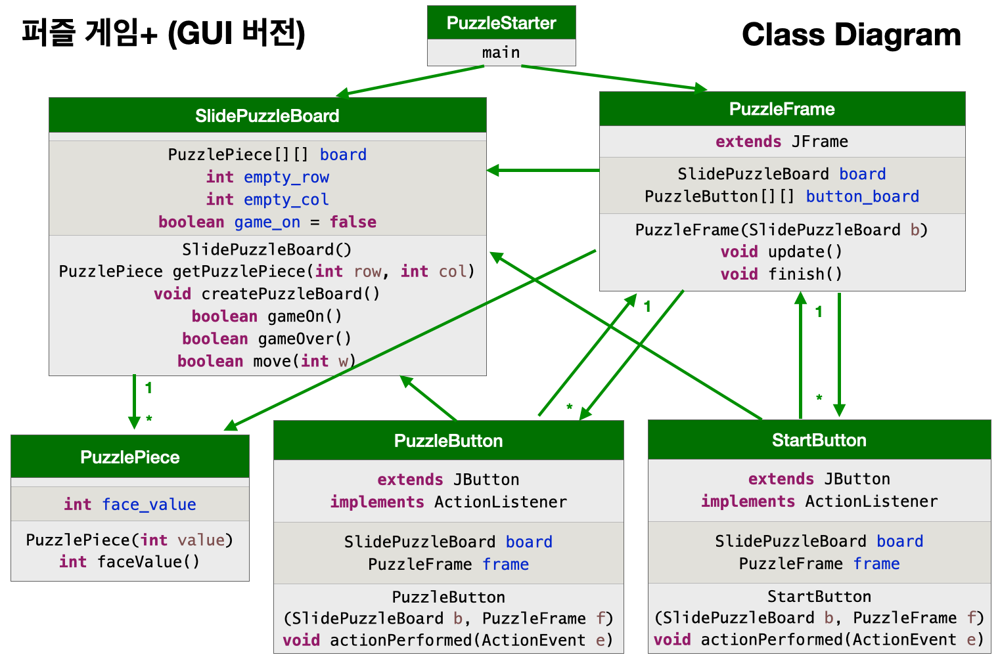
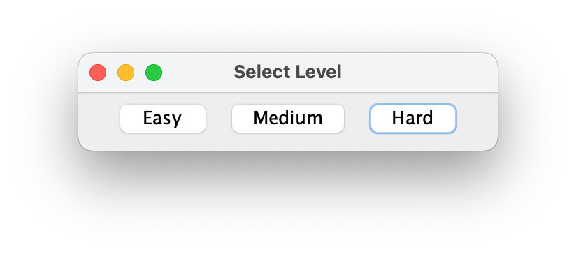
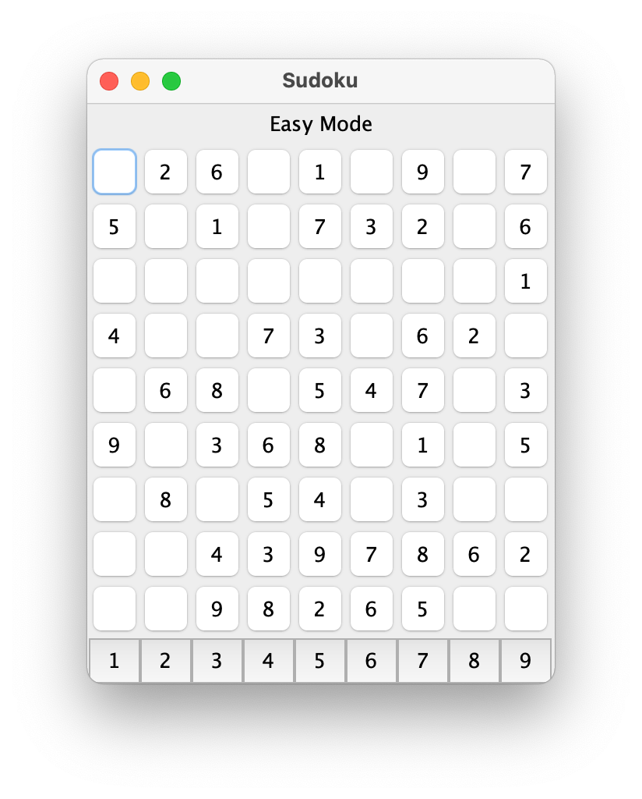
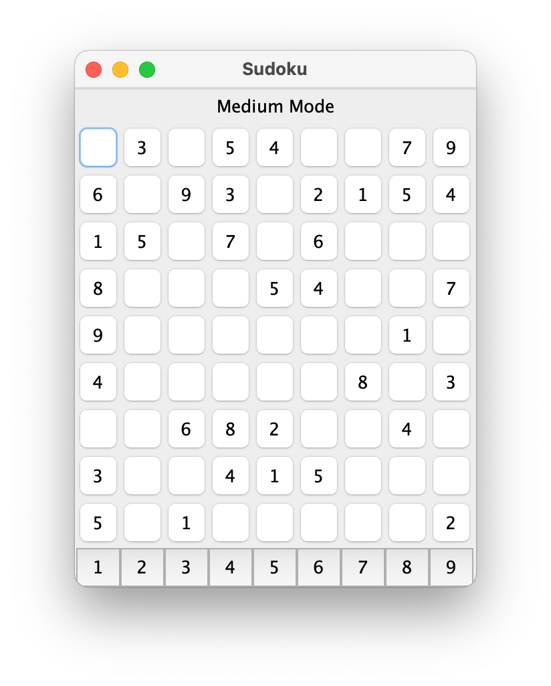
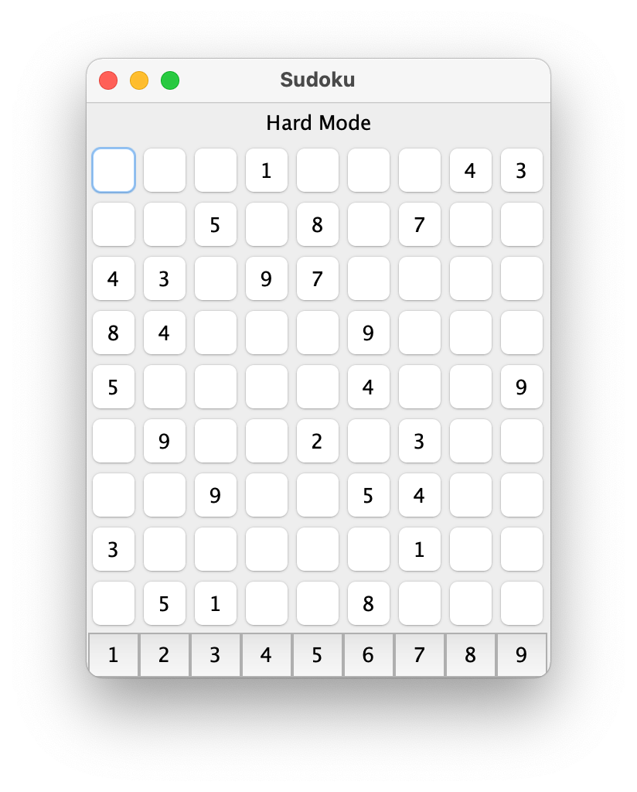
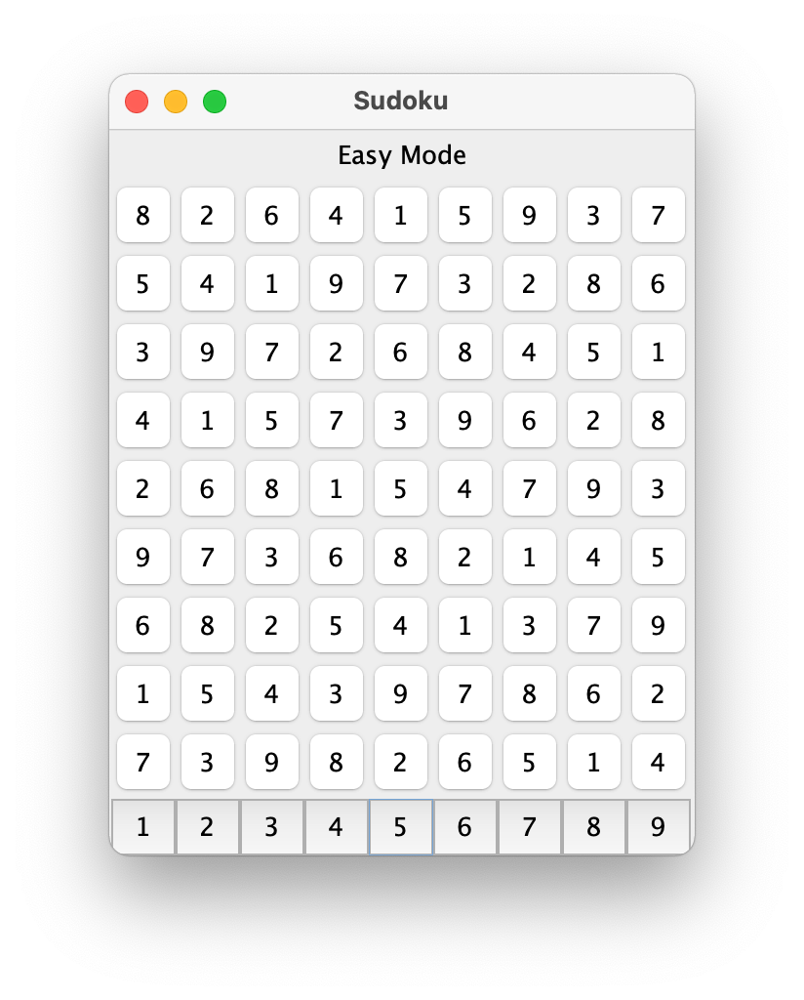
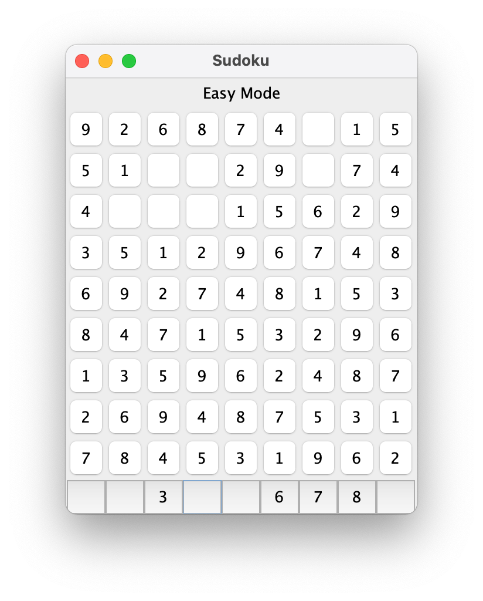

```
(c)도경구 version 0.1 (2021/11/15)
```

## 9. GUI와 이벤트 구동 프로그래밍 (계속)

### 실습 - 슬라이드 퍼즐 게임

지난 실습 시간에 작성한 퍼즐 게임을 다음의 요구사항와 맟추어 개선하자.

- 애플리케이션을 실행하면 다음과 같은 퍼즐 보드 창을 띄운다. 



- 상단에 위치한 `Start` 버튼을 누르면 아래와 같이 우하단 구석에 있는 한 칸을 비운 채로 퍼즐 조각을 무작위로 섞은 퍼즐 보드가 생기며 퍼즐 게임을 시작한다.
- 퍼즐 조각을 움직여 퍼즐 보드를 위와 똑같이 만들면 게임이 끝난다.



- 퍼즐 보드의 재배치를 완료하면 다음과 같이 우하단 빈 칸에 `Done` 이라고 표시되면서 게임이 끝난다.



- 게임이 끝나면 어떤 버튼을 누르더라도 퍼즐 조각이 움직이지 않아야 한다.
- 언제든지 `Start` 버튼을 누르면 다시 처음부터 퍼즐 게임을 할 수 있어야 한다.

#### 설계도




### 숙제 -  스도쿠 퍼즐 게임 추가 개선 (제출 마감: 11월 23일 13:00)

지난 숙제로 작성한 스도쿠 퍼즐 게임 애플리케이션에 다음과 같은 두 가지 요구사항을  추가 구현하자.

#### 1단계 요구사항 [1점]

플레이어가 다음의 세 단계 난이도 중에서 하나를 선택하여 게임을 할 수 있도록 하자.

- 하 : `Easy` - 빈 칸 36개
- 중 : `Medium` - 빈 칸 45개
- 하 : `High` - 빈 칸 54개

애플리케이션을 실행하면 난이도를 선택하는 버튼을 다음과 같이 가로로 나열한 창이 나타난다.



버튼을 하나 골라서 클릭하면 난이도에 따라 다음과 같은 수도쿠 보드가 있는 창이 나타난다.





이 후 퍼즐 게임은 전과 같은 방법으로 진행한다.

다음은 퍼즐 게임을 완료한 창의 모습이다.



#### 2단계 요구사항 [1점]

맨 아래에 있는 숫자 선택 버튼은 빈 칸을 채울 수 있을 만큼만 클릭할 수 있게 한다. 즉, 해당 숫자가 보드에 모두 채워져서 더 이상 필요 없는 숫자는 아래 그림과 같이 보이지도 않고 클릭할 수도 없도록 해야 한다.




